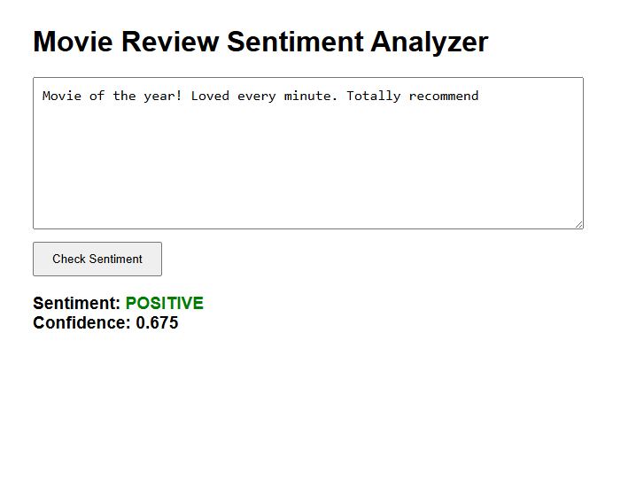

# 🎬 Sentiment Analyzer — Movie Review Classifier

A lightweight machine learning web app that analyzes the **sentiment** (positive or negative) of user-submitted movie reviews using a trained Logistic Regression model.

Built with:
- Python + FastAPI (backend API)
- HTML/CSS/JS (frontend)
- scikit-learn for training the model

---

## 🚀 Demo

> Paste a review, hit "Check Sentiment" and get instant feedback.



---

## 🔍 How It Works

1. Trains a sentiment classifier on 2000 reviews from the [IMDb dataset](http://ai.stanford.edu/~amaas/data/sentiment/)
2. Uses `TfidfVectorizer` + `LogisticRegression`
3. Exposes a `/predict` endpoint via FastAPI
4. Frontend calls the API and displays the prediction with confidence

---

## 🧠 Example

**Input:**
> “This movie was surprisingly good. I expected nothing and got a great experience.”

**Output:**
```json
{
  "sentiment": "positive",
  "confidence": 0.92
}


---

## 🧭 Why I Built This

As an AI engineer with a background in education, I wanted a hands-on project that would give me experience with training a real ML model (start to finish), including vectorization, model loading

I chose sentiment analysis because it's a classic NLP task with a clear use case and simple user interaction. The perfect starting-off point.

---

## 🧠 What I Learned

- How to preprocess real-world text data
- How to use TF-IDF and Logistic Regression for classification
- How to serve ML models with FastAPI